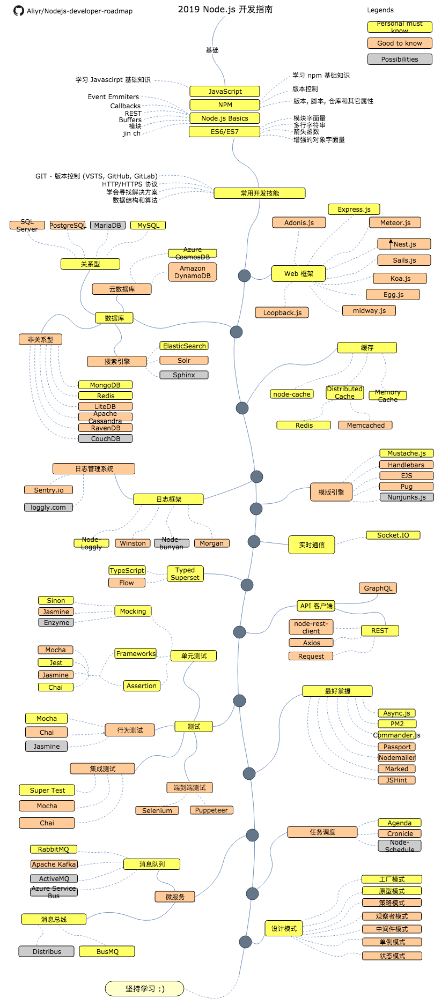

# Node.js 开发者指南

> 2019 年 [Node.js](https://nodejs.org/en/) 开发者指南:

你可以在下面找到一张图，该图展示了你可以选取的路径及你想学习的库，从而成为一名 Node.js 开发者。“作为 Node.js 开发者，我接下来应该学习什么？”，我把这张图作为建议给每个问过我这一问题的人。

* 语言: [:cn: 中文](ReadMe-CN.md) | [:uk: English](/ReadMe.md)

## 免责声明

> 该指南的目的是为了给读者有个大概的轮廓。如果你对接下来要学习的内容感到困惑，这张路线图将给你指导，而不是鼓励你选择时髦的东西。你应该逐渐理解为什么一种工具比另一种工具更适合某些场景，并且记住时髦和新颖的东西并不总是意味着最适合这个工作。

## 请给一个星星! :star:

如果你喜欢或正在使用这个项目进行学习或引用在你的解决方案中，请不要吝啬你的小星星哦。谢谢!

## 路线图

## 资源

1. 基础

   - [JavaScript](https://www.w3schools.com/js/)
   - [NPM](https://docs.npmjs.com/)
   - [Node.js](https://nodejs.org/en/docs/) | [开源项目 Node.js 技术栈学习指南](https://www.nodejs.red)
   - ES6/ES7

2. 常用开发技能

   - 学习 GIT, 在 GitHub 上创建一些项目, 并和其他人分享你的代码
   - 掌握 HTTP(S) 协议, 及其请求方法 (GET, POST, PUT, PATCH, DELETE, OPTIONS)
   - 不要害怕使用 Google, [使用 Google 进行强力搜索](http://www.powersearchingwithgoogle.com/)
   - 阅读一些关于算法和数据结构的书籍

3. Web 框架

   1. [Express.js](https://expressjs.com/)
   2. [Adonis.js](https://adonisjs.com/)
   3. [Meteor.js](https://www.meteor.com/)
   4. [Nest.js](https://nestjs.com/)
   5. [Sails.js](https://sailsjs.com/)
   6. [Koa.js](https://koajs.com/)
   7. [Loopback.js](https://loopback.io/)
   8. [egg.js](https://eggjs.org/zh-cn/)
   9. [midway](https://midwayjs.org/midway/)

4. 数据库

   1. 关系型
      1. [SQL Server](https://www.microsoft.com/en-us/sql-server/sql-server-2017)
      2. [PostgreSQL](https://www.postgresql.org/)
      3. [MariaDB](https://mariadb.org/)
      4. [MySQL](https://www.mysql.com/)
   2. 云数据库
      - [CosmosDB](https://docs.microsoft.com/en-us/azure/cosmos-db)
      - [DynamoDB](https://aws.amazon.com/dynamodb/)
   3. 搜索引擎
      - [ElasticSearch](https://www.elastic.co/)
      - [Solr](http://lucene.apache.org/solr/)
      - [Sphinx](http://sphinxsearch.com/)
   4. 非关系型数据库
      - [MongoDB](https://www.mongodb.com/)
      - [Redis](https://redis.io/)
      - [Apache Cassandra](http://cassandra.apache.org/)
      - [LiteDB](https://github.com/mbdavid/LiteDB)
      - [RavenDB](https://github.com/ravendb/ravendb)
      - [CouchDB](http://couchdb.apache.org/)

5. 缓存

   1. [Node-Cache](https://www.npmjs.com/package/node-cache)
   2. Distributed Cache
      1. [Redis](https://redis.io/)
      2. [Memcached](https://memcached.org/)
   3. [Memory Cache](https://www.npmjs.com/package/memory-cache)

6. 日志

   1. 日志框架
      - [Node-Loggly](https://www.loggly.com/docs/node-js-logs-2/)
      - [Winston](https://github.com/winstonjs/winston)
      - [Node-Bunyan](https://github.com/trentm/node-bunyan)
      - [Morgan](https://github.com/expressjs/morgan)
   2. 日志管理系统
      - [Sentry.io](http://sentry.io)
      - [Loggly.com](https://loggly.com)

7. 模板引擎

   1. [Mustache.js](https://mustache.github.io/)
   2. [Handlebars](https://handlebarsjs.com/)
   3. [EJS](https://ejs.co/)
   4. [Pug](https://pugjs.org/api/getting-started.html)
   4. [Nunjunks.js](https://mozilla.github.io/nunjucks/)

8. 实时通信

   1. [Socket.IO](https://socket.io/)

9. Typed Superset

    1. [TypeScript](https://www.typescriptlang.org/)
    2. [Flow](https://flow.org/)

10. API Clients

    1. REST
       - [Request](https://github.com/request/request)
       - [Node-Rest-Client](https://www.npmjs.com/package/node-rest-client)
       - [Axios](https://github.com/axios/axios)
    2. [GraphQL](https://graphql.org/)

11. 最好掌握

    - [Async.js](https://caolan.github.io/async/)
    - [PM2](http://pm2.keymetrics.io/)
    - [Commander.js](https://github.com/tj/commander.js/)
    - [Passport](http://www.passportjs.org/)
    - [Nodemailer](https://nodemailer.com/about/)
    - [Marked](https://marked.js.org/#/README.md#README.md)
    - [JSHint](https://github.com/jshint/jshint)

12. 测试

    1. 单元测试, 行为测试, 集成测试
       1. [Jest](https://jestjs.io/)
       2. [Jasmine](https://jasmine.github.io/)
       3. [Chai](https://www.chaijs.com/)
       4. [Mocha](https://mochajs.org/)
       5. [Enzyme](https://github.com/airbnb/enzyme)
       6. [Sinon](https://sinonjs.org/)
    2. 端到端测试
       - [Selenium](https://help.crossbrowsertesting.com/selenium-testing/getting-started/javascript/)
       - [Puppeteer](https://github.com/GoogleChrome/puppeteer)

13. 任务调度

    - [Agenda](https://github.com/agenda/agenda)
    - [Cronicle](https://github.com/jhuckaby/Cronicle)
    - [Node-Schedule](https://www.npmjs.com/package/node-schedule)
    
14. 微服务

    1. 消息队列
       - [RabbitMQ](https://www.rabbitmq.com/tutorials/tutorial-one-javascript.html)
       - [Apache Kafka](https://www.npmjs.com/package/kafka-node)
       - [ActiveMQ](https://github.com/apache/activemq)
       - [Azure Service Bus](https://docs.microsoft.com/en-us/azure/service-bus-messaging/service-bus-messaging-overview)
    2. 消息总线
       - [Distribus](https://distribus.com/)
       - [BusMQ](https://github.com/capriza/node-busmq)

15. [设计模式](https://www.pluralsight.com/courses/javascript-practical-design-patterns)

## 总结

如果你认为该指南可以改进，请提交包含任何更新的 PR 并提交任何问题。此外，我将继续改进这个仓库，因此你可以 star 这个仓库以便于重新访问。

灵感来源 : [ASP.NET Core Developer Roadmap](https://github.com/MoienTajik/AspNetCore-Developer-Roadmap)

## 贡献

该指南是使用 [Draw.io](https://www.draw.io/) 构建的。中文版项目文件为 `Node.js-developer-roadmap.cn.xml`。要修改它, 请打开 draw.io, 点击 Open Existing Diagram 并选择项目中的 xml 文件。它将为你渲染生成路线图，更新它，上传和更新自述文件中的图像并创建一个 PR（导出为400%的png图片，然后使用 [Compressor.io](https://compressor.io/compress) 压缩）。

- 改进后提交 PR
- 在Issues中讨论问题
- 推广项目

## 许可协议

