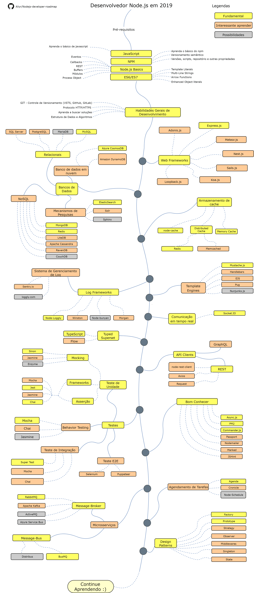

# Roteiro do Desenvolvedor Node.js

> Roteiro para se tornar um desenvolvedor [Node.js](https://nodejs.org/en/) em 2019:

Abaixo, você pode encontrar um gráfico demonstrando os caminhos que você pode seguir e as bibliotecas que deseja aprender para se tornar um desenvolvedor Node.js. Fiz este grafico como uma dica a todos que me perguntam:"O que devo aprender para me tornar um desenvolvedor Node.js?"

* Idioma: [:cn: 中文](ReadMe-CN.md) | [:pt: Português](/ReadMe-PT.md) | [:uk: English](/ReadMe.md)

## Aviso

> O propósito deste roteiro é fornecer uma ideia sobre o panorama. O roteiro o guiará se estiver confuso sobre o que seguir e aprender, em vez de encorajá-lo a escolher o que há de mais moderno. Você deve entender melhor cada ferramenta e porque ela será mais adequada para alguns casos do que outra e lembre-se que o nem sempre o que esta na moda será o melhor para o trabalho.

## Dê uma estrela! :star:

Se você esta gostando ou está utilizando este projeto para aprender ou iniciar sua solução, dê uma estrela a ele. Obrigado!

## Roteiro

## Recursos

1. Pré-requisitos

   - [JavaScript](https://www.w3schools.com/js/)
   - [NPM](https://docs.npmjs.com/)
   - [Node.js](https://nodejs.org/en/docs/)
   - ES6/ES7

2. Habilidades Gerais de Desenvolvimento

   - Aprenda GIT, crie alguns repositórios no GitHub, compartilhe seu código com outra pessoas
   - Conheça o protocolo HTTP(S), métodos de requisição (GET, POST, PUT, PATCH, DELETE, OPTIONS)
   - Não tenha medo de usar o Google, [Power Searching with Google](http://www.powersearchingwithgoogle.com/)
   - Leia alguns livros sobre algoritmos e estruturas de dados.

3. Web Frameworks

   1. [Express.js](https://expressjs.com/)
   2. [Adonis.js](https://adonisjs.com/)
   3. [Meteor.js](https://www.meteor.com/)
   4. [Nest.js](https://nestjs.com/)
   5. [Sails.js](https://sailsjs.com/)
   6. [Koa.js](https://koajs.com/)
   7. [Loopback.js](https://loopback.io/)
   8. [egg.js](https://eggjs.org/en/index.html)
   9. [midway](https://midwayjs.org/midway/en/)

4. Bases de Dados

   1. Relacional
      1. [SQL Server](https://www.microsoft.com/en-us/sql-server/sql-server-2017)
      2. [PostgreSQL](https://www.postgresql.org/)
      3. [MariaDB](https://mariadb.org/)
      4. [MySQL](https://www.mysql.com/)
   2. Bancos de Dados em nuvem
      - [CosmosDB](https://docs.microsoft.com/en-us/azure/cosmos-db)
      - [DynamoDB](https://aws.amazon.com/dynamodb/)
   3. Mecanismos de Pesquisa
      - [ElasticSearch](https://www.elastic.co/)
      - [Solr](http://lucene.apache.org/solr/)
      - [Sphinx](http://sphinxsearch.com/)
   4. NoSQL
      - [MongoDB](https://www.mongodb.com/)
      - [Redis](https://redis.io/)
      - [Apache Cassandra](http://cassandra.apache.org/)
      - [LiteDB](https://github.com/mbdavid/LiteDB)
      - [RavenDB](https://github.com/ravendb/ravendb)
      - [CouchDB](http://couchdb.apache.org/)

5. Armazenamento de cache

   1. [Node-Cache](https://www.npmjs.com/package/node-cache)
   2. Distributed Cache
      1. [Redis](https://redis.io/)
      2. [Memcached](https://memcached.org/)
   3. [Memory Cache](https://www.npmjs.com/package/memory-cache)

6. Logging

   1. Log Frameworks
      - [Node-Loggly](https://www.loggly.com/docs/node-js-logs-2/)
      - [Winston](https://github.com/winstonjs/winston)
      - [Node-Bunyan](https://github.com/trentm/node-bunyan)
      - [Morgan](https://github.com/expressjs/morgan)
   2. Log Management System
      - [Sentry.io](http://sentry.io)
      - [Loggly.com](https://loggly.com)

7. Template Engines
   1. [Mustache.js](https://mustache.github.io/)
   2. [Handlebars](https://handlebarsjs.com/)
   3. [EJS](https://ejs.co/)
   4. [Pug](https://pugjs.org/api/getting-started.html)
   4. [Nunjunks.js](https://mozilla.github.io/nunjucks/)

8. Comunicação em tempo real

   1. [Socket.IO](https://socket.io/)

9. Typed Superset

    1. [TypeScript](https://www.typescriptlang.org/)
    2. [Flow](https://flow.org/)

10. API Clients

    1. REST
       - [Request](https://github.com/request/request)
       - [Node-Rest-Client](https://www.npmjs.com/package/node-rest-client)
       - [Axios](https://github.com/axios/axios)
    2. [GraphQL](https://graphql.org/)

11. Bom Conhecer

    - [Async.js](https://caolan.github.io/async/)
    - [PM2](http://pm2.keymetrics.io/)
    - [Commander.js](https://github.com/tj/commander.js/)
    - [Passport](http://www.passportjs.org/)
    - [Nodemailer](https://nodemailer.com/about/)
    - [Marked](https://marked.js.org/#/README.md#README.md)
    - [JSHint](https://github.com/jshint/jshint)

12. Testes

    1. Unit, Behavior, Integration Testing
       1. [Jest](https://jestjs.io/)
       2. [Jasmine](https://jasmine.github.io/)
       3. [Chai](https://www.chaijs.com/)
       4. [Mocha](https://mochajs.org/)
       5. [Enzyme](https://github.com/airbnb/enzyme)
       6. [Sinon](https://sinonjs.org/)
    2. E2E Testing
       - [Selenium](https://help.crossbrowsertesting.com/selenium-testing/getting-started/javascript/)
       - [Puppeteer](https://github.com/GoogleChrome/puppeteer)

13. Agendamento de tarefas

    - [Agenda](https://github.com/agenda/agenda)
    - [Cronicle](https://github.com/jhuckaby/Cronicle)
    - [Node-Schedule](https://www.npmjs.com/package/node-schedule)
    
14. Microserviços

    1. Message-Broker
       - [RabbitMQ](https://www.rabbitmq.com/tutorials/tutorial-one-javascript.html)
       - [Apache Kafka](https://www.npmjs.com/package/kafka-node)
       - [ActiveMQ](https://github.com/apache/activemq)
       - [Azure Service Bus](https://docs.microsoft.com/en-us/azure/service-bus-messaging/service-bus-messaging-overview)
    2. Message-Bus
       - [Distribus](https://distribus.com/)
       - [BusMQ](https://github.com/capriza/node-busmq)

15. [Design-Patterns](https://www.pluralsight.com/courses/javascript-practical-design-patterns)
16. [JavaScript Algorithms and Data Structures](https://github.com/trekhleb/javascript-algorithms/)

## Conclusão

Se você acha que o roteiro pode ser melhorado, abra um PR com todas as atualizações e envie quaisquer problemas. Além disso continuarei a melhorar, então você pode marcar como favorito para revisitar este repositório.

Inspiração : [ASP.NET Core Developer Roadmap](https://github.com/MoienTajik/AspNetCore-Developer-Roadmap)

## Contribuição

O roteiro é criado usando [Draw.io](https://www.draw.io/). O arquivo do projeto pode ser encontrado no arquivo `Node.js-developer-roadmap.xml`. Para modificá-lo, abra o aquivo no draw.io, clique em **Open Existing Diagram** e escolha o arquivo `xml`. Ele abrirá o roteiro. Atualize-o, faça o upload das imagens no readme e crie um PR (exporte a imagem com 400% de zoom e formato png e reduza o seu tamanho no [Compressor.io](https://compressor.io/compress)).

- Abra um pull request com melhorias
- Discuta as idéias em questões
- Divulgue a palavra

## Licença

